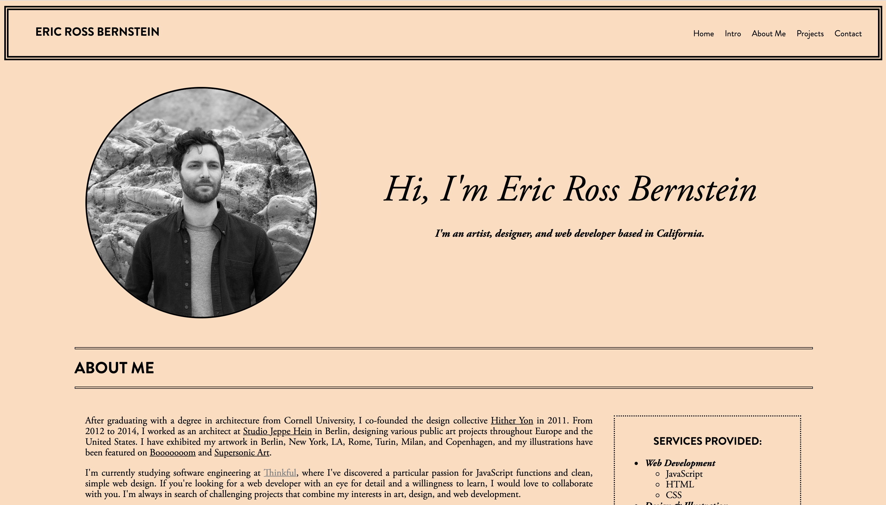
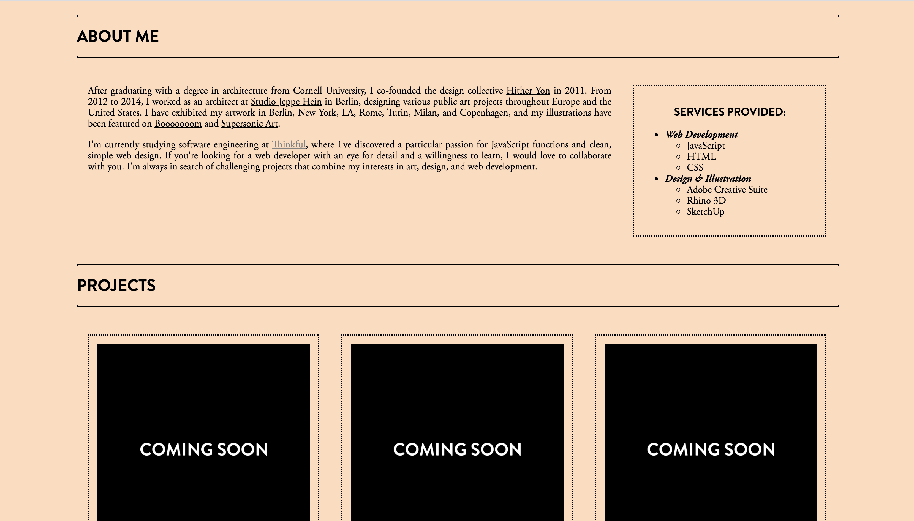
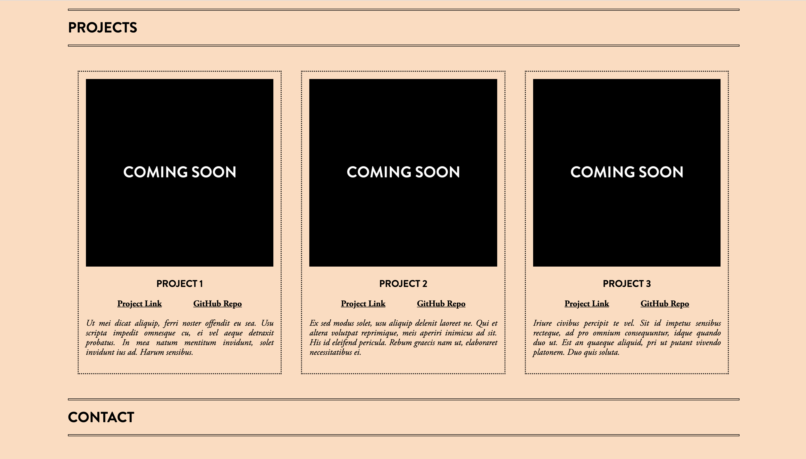
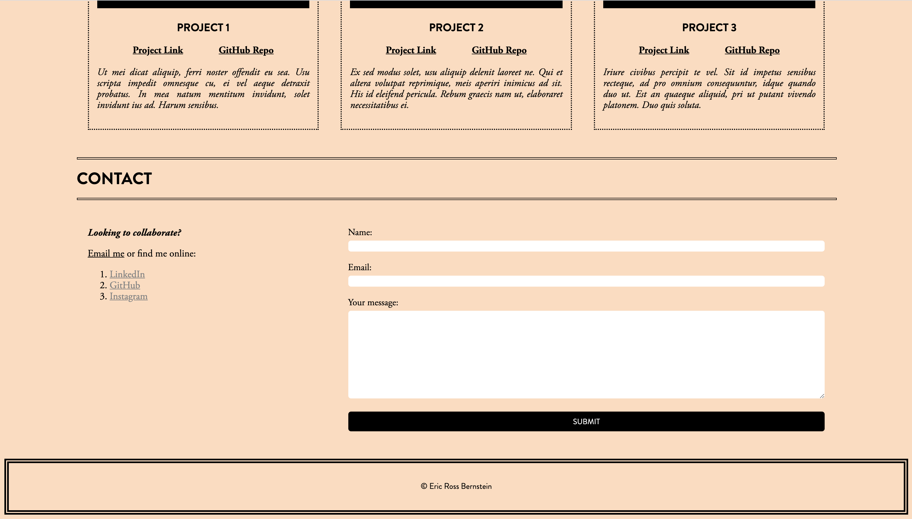

# Portfolio Web Page

## Summary

One-page website template created as part of Thinkful's Software Engineering program. Implemented my new frontend development skills such as flexbox, forms, links, and classes. Designed a simple and sleek interface using vanilla CSS.

## Deployed Application

https://ericrossbernstein.github.io/portfolio-web-page/

## Tech Stack

HTML, CSS

## Client

#### Intro

#### About Me

#### Projects

#### Contact

